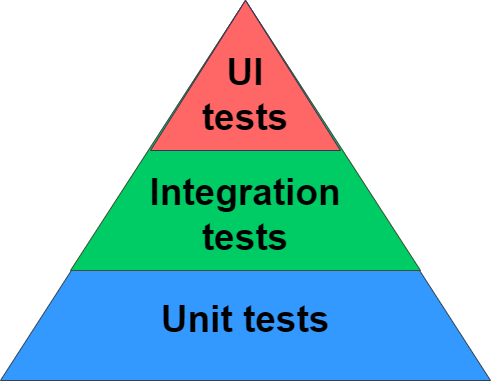
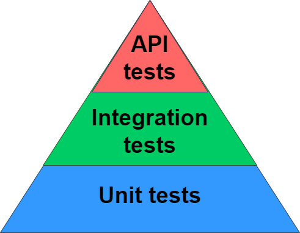
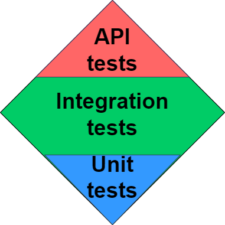
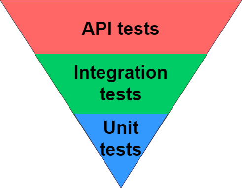
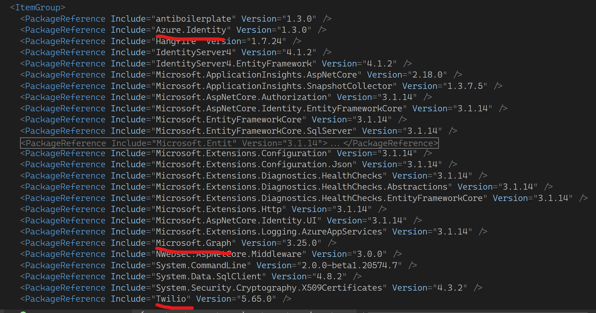
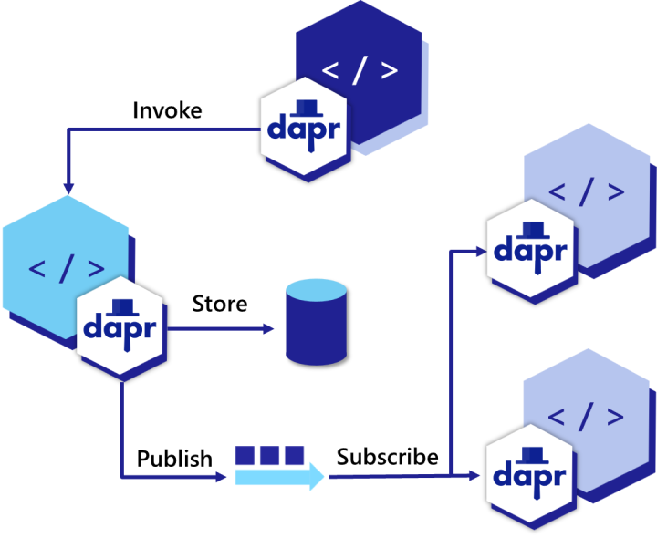
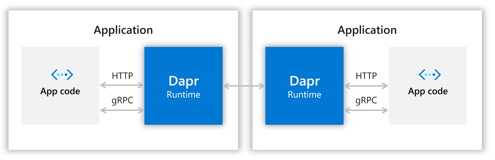
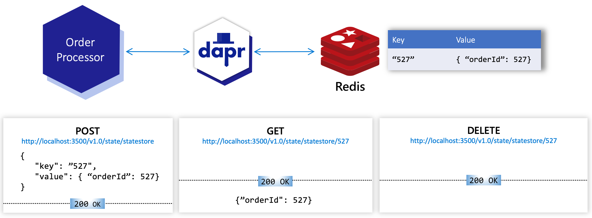
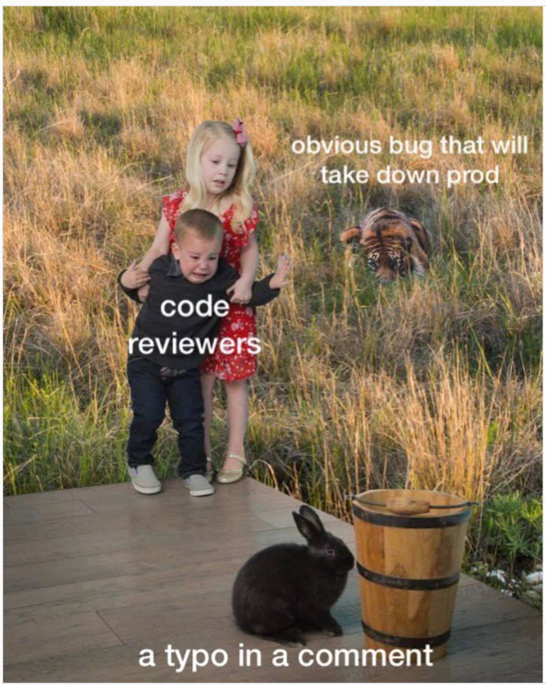

class: center, middle

# Making **test-friendly** microservices with **DAPR**

#### Swetugg Göteborg ✌️ Vidar Kongsli

---

# Vidar

---

# Testing...

???

* We are going to talk about testing
* A topic that is near and dear to my heart, and has been for many years

---

# DAPR

???

* And we are going to talk about DAPR. How many of you know about DAPR?
* Mind you, it is not Dapper - the lightweight object relational mapper, but DAPR
* We will talk more about DAPR later on, but first focus a little on the testing part

---

# The promise of microservices

What are microservices 🤔?

1. Highly maintainable and testable
1. Loosely coupled
1. Independently deployable
1. Organized around business capabilities
1. Owned by a small team

???

* Point one: highly maintainable and testable
* There it is, testable. I would argue that this does not come automatically, you have to work for it. Let's have a look at the challenges and possible solutions
* Some of the other points are also interesting. Loosely coupled. Independenly deployable
* Let's keep these in mind for later

---

# Testing

## ... we really mean automated testing

???

* I am not too fond of many of the distinctions, like unit tests, integration tests, acceptancy tests and the rest of it
* Quite frankly, I do not care too much of the defintions.
* But before moving on, spend a second on what would be the ideal test to you...

---

class: center, middle
# Testing

.img-width-all[]

???

* One way of looking at it is the so-called testing pyramid
* It tries to convey the number of tests you should have of the different types of tests
* You should have more unit tests than integration tests, and more integration tests than UI tests.
* The main argument here, is that the unit tests are easier to handle and quicker to execute than integration tests

---

class: center, middle

# Testing

.img-width-all[]

???

* Of course, this talk is about microservices, so lets call them API tests instead of UI tests

---

class: center, middle

# Testing

.img-width-all[]

???

* I tend to disagree with this view, and I would say that maybe it should look like this.
* Maybe we could call it the testing diamond.
* Again, I am not too preoccupied with definitions of test types here
* But of course it depends on how you define a unit tests, meaning what is your definition of a unit?
* I use the definition that the unit is a type, or in OO often a class

---

class: center, middle

# Testing

.img-width-all[]

???

* If we take it a bit further, I could even suggest that we for a microservice would have something like this.
* With API tests, I mean that we test the microservice as a whole.
* Integration tests would be tests for various components within the microservice.

---

# Unit tests ("class tests")

* Do not catch problems "in between"
* Difficult to test for the correct conditions
* Spend much time simulating the environment; mocking and stubbing
* Too brittle in terms of refactoring - spend a lot of time rewriting
* Tests do not really have to be super quick
* A class of tests could be left to the compiler
  * Null checks
  * Input validation

---

class: center, middle

# *Let API or integration tests be the norm, and leave unit tests for the special cases.*

???

* So, the basic idea here can be summarized as follows
* The next question is how we can do this

---

---
<figure>
.img-width-all[]
<figcaption align="center">Photo by <a href="https://unsplash.com/@ficklesupreme?utm_source=unsplash&utm_medium=referral&utm_content=creditCopyText">Max Simonov</a> on <a href="https://unsplash.com/s/photos/sidecar?utm_source=unsplash&utm_medium=referral&utm_content=creditCopyText">Unsplash</a></figcaption>
</figure>

---

class: center, middle

# Hva er utfordringene med å utvikle microservices?

---

# Utfordring: avhengigheter

* Biblioteker
* API-er
* Lære seg API-enes mekanismer
* Holde avhengighetene oppdatert

---

# Avhengigheter: eksempel

.img-width-all[]

---

# Utfordring: testing

* Hvordan skal man kunne teste en microtjeneste
   * ... i isolasjon?
   * ... i lokalt utviklingsmiljø?

---

# Utfordring: konfigurasjon

* Mange muligheter for å konfigurere en applikasjon
  1. Miljøvariable?
  1. Konfigurasjonsfiler?
  1. Kommandolinje?
  1. Diverse nettsky-alternativer
  1. I koden?

* Hvordan lage en kosistent konfigurasjon med miljøavhengige parametre?
* Testing: Mocking / stubbing av alle API-er

---

class: center

# DAPR

.left-column[
### APIs for building portable and reliable microservices

]
.right-column[.img-width-half[]]

---

class: center

# Demo

<figure>
.img-width-all[]
<figcaption align="center">Photo by <a href="https://unsplash.com/@jademasri?utm_source=unsplash&utm_medium=referral&utm_content=creditCopyText">Jade Masri</a> on <a href="https://unsplash.com/s/photos/sidecar?utm_source=unsplash&utm_medium=referral&utm_content=creditCopyText">Unsplash</a></figcaption>
</figure>

---

# Kommunikasjon med Dapr

.img-width-all[]

* HTTP eller gRPC
* To-veis:
   * Applikasjon kaller Dapr API (*"pull"*)
   * Dapr kaller endepunkter som applikasjonen eksponerer (*"push"*)

---

# (Enda en) demo

<figure>
.img-width-all[]
<figcaption align="center">Photo by <a href="https://unsplash.com/@hdsfotografie95?utm_source=unsplash&utm_medium=referral&utm_content=creditCopyText">hidde schalm</a> on <a href="https://unsplash.com/photos/u1zkgrqrKn0?utm_source=unsplash&utm_medium=referral&utm_content=creditCopyText">Unsplash</a>
  </figcaption>
</figure>

---

class: center

# Hva vi har sett:

## Service invocation

.img-width-all[]

---

class: center

# Hva vi har sett:

## Publish - subscribe

.img-width-all[]

---

class: center

# Hva vi har sett:

## State management

.img-width-all[]

---

class: center, middle

# Testing

.img-width-half[]

---

class: center, middle
# Testpyramiden

.img-width-two-thirds[]

---

class: center, middle
# Testpyramiden - 2

.img-width-all[]

---

class: center, middle
# Testpyramiden - 3

.img-width-all[]

---

class: center

# Applikasjon - Dapr

.img-width-all[]

---

class: center

# Applikasjon - tester

.img-width-all[]

---

class: center

# Applikasjon - testrammeverk

.img-width-all[]

---

class: center

# Applikasjon - TestServer (MS)

.img-width-all[]

---

class: center, middle

# Ad nubes (lat.)

.img-width-all[]

---

# Litt terminologi om kontainere

.left-column[

* **container image** - *An image is a read-only template with instructions for creating a Docker container. Often, an image is based on another image, with some additional customization.*
* **container** - *A container is a runnable instance of an image. You can create, start, stop, move, or delete a container using the Docker API or CLI. You can connect a container to one or more networks, attach storage to it, or even create a new image based on its current state.*
]
.right-column[.img-width-half[]]

---

# Litt terminologi om kontainere

.img-width-all[]

---
class: center

# Litt om Kubernetes

## Pods

.img-width-all[]

---
class: center

# Litt om Kubernetes

## Sidecars

.img-width-all[]

---
class: center

# Litt om Kubernetes

## Init containers

.img-width-all[]

---
class: center

# Litt om Kubernetes

## Nodes

.img-width-half[]

---
class: center

# Litt om Kubernetes

## Services - discovery

.img-width-all[]

---
class: center
# Ad Kubernetes

<figure>
.img-width-all[]
<figcaption align="center">Photo by <a href="https://unsplash.com/@austriannationallibrary?utm_source=unsplash&utm_medium=referral&utm_content=creditCopyText">Austrian National Library</a> on <a href="https://unsplash.com/s/photos/sidecar?utm_source=unsplash&utm_medium=referral&utm_content=creditCopyText">Unsplash</a></figcaption>
</figure>

---

class: center
# Dapr på K8S

.img-width-all[]

---

class: center

# Dapr/kalkulator på K8S

.img-width-all[]

---

class: center

# Dapr/kalkulator på K8S

.img-width-all[]

# 🤔

---

class: center
# Dapr/pub-sub på K8S

.img-width-all[]

---
class: center
# Ad Azure/AWS/Google Cloud

<figure>
.img-width-all[]
<figcaption align="center">Photo by <a href="https://unsplash.com/@revolt?utm_source=unsplash&utm_medium=referral&utm_content=creditCopyText">REVOLT</a> on <a href="https://unsplash.com/s/photos/sidecar?utm_source=unsplash&utm_medium=referral&utm_content=creditCopyText">Unsplash</a>
  </figcaption>
</figure>
---
class: center
# Ad Azure/AWS/Google Cloud
.img-width-all[]

---

# Dapr - byggeklosser

1. Service invocation
1. Publish & Subscribe
1. State management
1. Secret management
1. Input/output bindings
1. Virtual actors

---

# Dapr - fordeler

1. Secured connections
1. Observability
1. Resilient state
1. Reliable actors
1. Retries
1. Message guarantee
1. Discovery

---

# Oppnår vi noe?🤔

Microservices:

1. Highly maintainable and testable
1. Loosely coupled
1. Independently deployable
1. Organized around business capabilities
1. Owned by a small team

---
class: center, middle

.img-width-all[]

https://dapr.io
