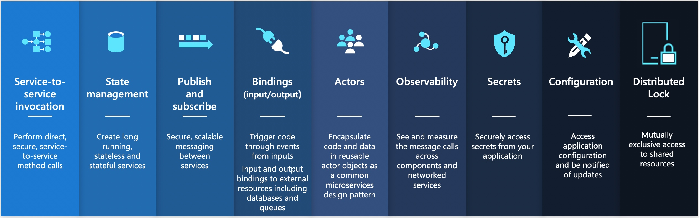
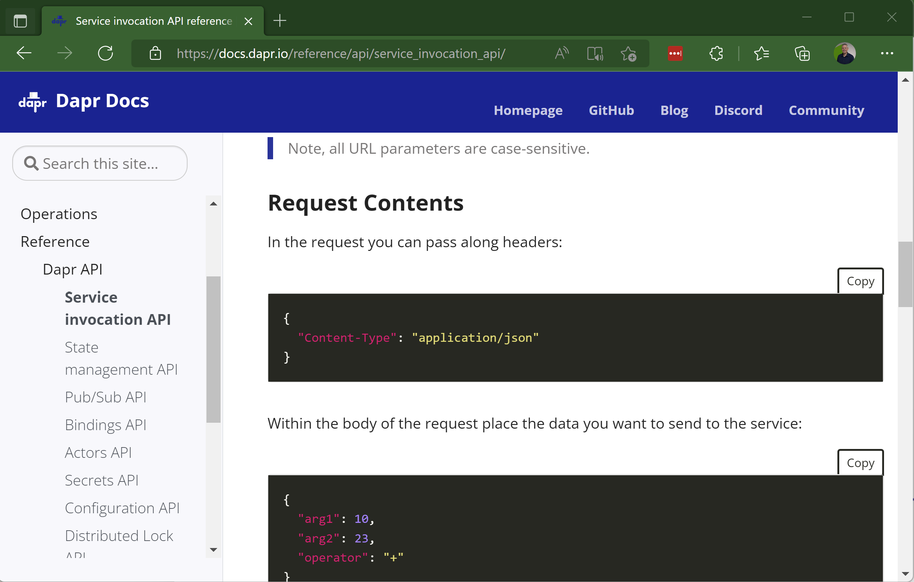
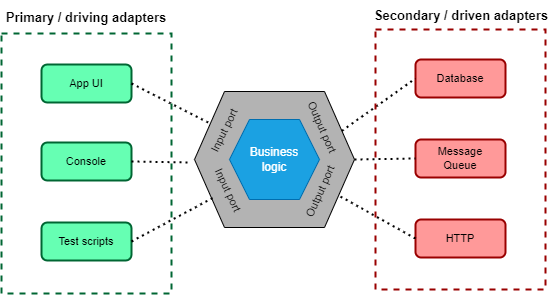
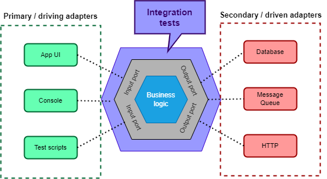
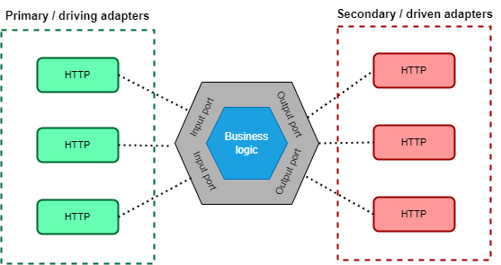
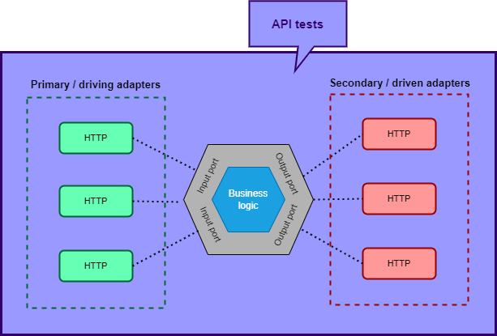

class: center, middle

# Making **test-friendly** microservices with **Dapr**

#### Swetugg Göteborg ✌️ Vidar Kongsli

---

# Vidar

---

class: center, middle

# Software testing

???

* We are going to talk about testing
* A topic that is near and dear to my heart, and has been for many years
* I assume that you are have a basic familiarity with automated software testing
* ...that you have written at least one test in code before

---

class: center, middle
# **Dapr**
# *Distributed Application Runtime*

???

* And we are going to talk about Dapr. How many of you know about Dapr?
* Mind you, it is not Dapper - the lightweight object relational mapper, but Dapr
* We will talk more about Dapr later on, but first focus a little on the testing part

---

# The promise of microservices

What are microservices 🤔?

1. Highly maintainable and testable
1. Loosely coupled
1. Independently deployable
1. Organized around business capabilities
1. Owned by a small team

???

* Point one: highly maintainable and testable
* There it is, testable. I would argue that this does not come automatically, you have to work for it. Let's have a look at the challenges and possible solutions
* Some of the other points are also interesting. Loosely coupled. Independenly deployable
* Let's keep these in mind for later

---

# Testing

## ... we really mean automated testing

???

* I am not too fond of many of the distinctions, like unit tests, integration tests, acceptancy tests and all the rest of it
* Quite frankly, I do not care too much of the defintions.
* But before moving on, spend a second on what would be the ideal test to you...

---

class: center, middle
# Testing pyramid

.img-width-all[]

???

* One way of looking at it is the so-called testing pyramid
* It tries to convey the number of tests you should have of the different types of tests
* You should have more unit tests than integration tests, and more integration tests than UI tests.
* The main argument here, is that the unit tests are easier to handle and quicker to execute than integration tests

---

class: center, middle

# Testing pyramid

.img-width-all[]

???

* Of course, this talk is about microservices, so lets call them API tests instead of UI tests

---

class: center, middle

# Testing *diamond*?

.img-width-all[]

???

* I tend to disagree with this view, and I would say that maybe it should look like this.
* Maybe we could call it the testing diamond.
* Again, I am not too preoccupied with definitions of test types here
* But of course it depends on how you define a unit tests, meaning what is your definition of a unit?
* I use the definition that the unit is a type, or in OO often a class

---

class: center, middle

# Upside-down testing pyramid

.img-width-all[]

???

* If we take it a bit further, I could even suggest that we for a microservice would have something like this.
* With API tests, I mean that we test the microservice as a whole.
* Integration tests would be tests for various components within the microservice.

---

# Unit tests

* Do not catch problems "in between"
* Cumbersome to test for the "real" conditions
* Spend much time simulating the environment; mocking and stubbing
* Too brittle in terms of refactoring - spend a lot of time rewriting
* A class of tests could be left to the compiler
  * Static types
  * Null checks
  * Input validation
* Tests do not really have to be super quick

???

* To put some arguments to the upside-down testing pyramid, let's dwell a bit on unit tests

---

class: center, middle

# *Let API or integration tests be the norm, and leave unit tests for the special cases.*

???

* So, the basic idea here can be summarized as follows
* The next question is how we can do this

---

class: center, middle

# *Very well. But how? 🤷‍♂️*

---

# Integration tests in ASP.NET

* In-memory test server
* Craft requests to the application that execute in-process
* Nuget package [Microsoft.AspNetCore.Mvc.Testing](https://www.nuget.org/packages/Microsoft.AspNetCore.Mvc.Testing)
* Article: [Integration tests in ASP.NET Core](https://docs.microsoft.com/en-us/aspnet/core/test/integration-tests?view=aspnetcore-6.0)

---
# Demo

.center[]

???

* 

---

# Challenge: dependencies

.center[.img-width-all[]]

???

* One challenge to microservices is how to handle its dependencies
* A list of dependencies such as this might be familiar to you
* A list of dependencies such as this also becomes a challenge to testing
* The particurlar challenge for testing in a situation like this, is how to handle the fact that the service reaches out to third party serviecs via libraries
* With this challenge in mind, it is about time to introduce Dapr into the mix!
* Biblioteker
* API-er
* Lære seg API-enes mekanismer
* Holde avhengighetene oppdatert


---

class: center

# Dapr

.left-column[
### APIs for building portable and reliable microservices

]
.right-column[.img-width-half[]]

---

# The sidecar pattern
<figure>
.img-width-all[]
<figcaption align="center">Photo by <a href="https://unsplash.com/@ficklesupreme?utm_source=unsplash&utm_medium=referral&utm_content=creditCopyText">Max Simonov</a> on <a href="https://unsplash.com/s/photos/sidecar?utm_source=unsplash&utm_medium=referral&utm_content=creditCopyText">Unsplash</a></figcaption>
</figure>

???

* One central concept in Dapr is the sidecar pattern
* As you may or may not know, a sidecar is originally an extra passenger seat stitched on to a motorcycle
* Quite rear and quaint these days, but depending on your age, you may or may not have seen one in real life. I am revealing my age here...

---

# Interaction with Dapr

.img-width-all[]

* HTTP or gRPC
* Two-way communication:
   * The application calls the Dapr API (*"pull"*)
   * Dapr calls endpoints exposed by the application (*"push"*)

---

class: center

# Service invocation

.img-width-all[]

---

class: center

# Publish - subscribe

.img-width-all[]

---

class: center

# State management

.img-width-all[]

---

class: center

# Dapr building blocks

### &nbsp;

.img-width-all[]

---

class: center
# What does this mean

## ...for development?

.img-width-all[]

???

* A developer would program against the Dapr APIs
* HttpClient is your friend
* Let's see how this would look like in code

---

# Named HttpClient

Program.cs:

```csharp
var daprHttpPort = Environment
  .GetEnvironmentVariable("DAPR_HTTP_PORT");

builder.Services.AddHttpClient("state", client => {
    client.BaseAddress
      = new Uri($"http://localhost:{daprHttpPort}/v1.0/state/");
});

builder.Services.AddHttpClient("publish", client => {
    client.BaseAddress
      = new Uri($"http://localhost:{daprHttpPort}/v1.0/publish/");
});
```

???

* Familiar with the HttpClientFactory pattern in .NET
* When the application runs in a Dapr-enabled infrastructure, the Dapr sidecar port is set as an environment variable
* The Dapr building block definitions give you the endpoint you need to call in the sidecar
* We use the "named" httpclient factory pattern

---

# Retrieve state

```cs
const STORE_NAME = "shorturls";

public async Task<ShortUrl> Get(string shortPath)
{
  var client = _httpClientFactory.CreateClient("state");
  var result = await client.GetAsync($"{STORE_NAME}/{shortPath}");
  if (result.StatusCode == HttpStatusCode.NoContent)
    return ShortUrl.Empty();
  if (result.IsSuccessStatusCode)
  {
    return await result.Content.ReadFromJsonAsync<ShortUrl>()
      ?? ShortUrl.Empty();
  }
  throw new Exception($"GET {result.RequestMessage?.RequestUri}"
    + $", error was {result.ReasonPhrase}");
}
```

???

* Create an HttpClient instance
* First path component is the store name, and second is the key
* If the key is not found, it returns no content (NOT 'not found', mind you!)
* Deserialize from Json into a typed object

---

# Save state

```cs
public record SaveRequest<T>(string Key, T Value);

const STORE_NAME = "shorturls";

public async Task Save(params ShortUrl[] shortUrls)
{
  var client = _httpClientFactory.CreateClient("state");
  var result = await _client.PostAsJsonAsync(STORE_NAME,
    shortUrls.Select(shortUrl
      => new SaveRequest<ShortUrl>(shortUrl.ShortPath, shortUrl)));
  if (!result.IsSuccessStatusCode)
  {
    throw new Exception($"GET {result.RequestMessage?.RequestUri}"
      + $", error was {result.ReasonPhrase}");
  }
}
```

???

* Saving state is very similar, only use 'POST', and have the key as part of the payload
* Create a SaveRequest record to wrap the payload
* Can even save several objects at a time

---

# Publish to a topic

```cs
const string PUBSUB_NAME = "urlshortener-pub-sub";
const string TOPIC_NAME = "requests";

public record RequestEvent (string Id, string ShortPath, bool IsMatch,
  DateTimeOffset TimeStamp, string? Browser = null,
  string? Region = null, string? Country = null,
  string? IpAddress = null);

var requestEvent = new RequestEvent(Guid.NewGuid().ToString(),
  shortPath, found, DateTimeOffset.UtcNow,
  IpAddress: httpRequest
    .HttpContext.Connection.RemoteIpAddress?.ToString());

var client = _httpClientFactory.CreateClient("publish");
await client.PostAsJsonAsync($"{PUBSUB_NAME}/{TOPIC_NAME}",
  requestEvent);
```

???

* Publishing a message to a topic is similar to saving state
* This time, we use the "publish" http client
* Need the name of the pub sub component and the topic name

---

# Subscribe to a topic

```cs
public record DaprData<T>
  ([property: JsonPropertyName("data")] T Data); 

public class EventNotificationController
{
  private const string PUBSUB_NAME = "urlshortener-pub-sub";
  private const string TOPIC_NAME = "requests";

  [Topic(PUBSUB_NAME, TOPIC_NAME)]
  [HttpPost("request")]
  public async Task<IActionResult> ReceiveRequestEvent(
    [FromBody]DaprData<RequestEvent> message)
  {
    var requestEvent = message.Data;
    var wasProccessedCorrectly = ...;
    return wasProccessedCorrectly
      ? new OkResult()
      : new StatusCodeResult((int)HttpStatusCode.TooManyRequests); 
    }
```

???

* Now it gets more interesing
* Subscribing to a topic is different
* The integration here is a push to the application via a controller

---

# What does this mean
## ...for testing?

???

* We have now gotten a little insight into how the code will look like when interacting with Dapr
* Let's zoom out a little bit and what repercussions this will have for the application architecture

---

# Ports and adapters

### A.k.a. *Hexagonal architecture*

.center[.img-width-all[]]

???

* Let's consider the ports and adapters software architecture pattern
* It was coined some years ago by Alistair Cockburn, one of the authors of the agile manifesto
* An alternative to the earlier, layered archtecture for software
* Depics the business logic of the application to be at the core
* Ports provide a generic way to communicate with the business logic, separated into input and output ports
* Adapters implement specific ways the environment communicates with the application core (via ports)
* Separated into primary/driving adapters, and secondary/driven adapters

https://alistair.cockburn.us/hexagonal-architecture/
https://en.wikipedia.org/wiki/Hexagonal_architecture_(software)
https://medium.com/idealo-tech-blog/hexagonal-ports-adapters-architecture-e3617bcf00a0

---

# Integration tests

### ...with ports and adapters

.center[.img-width-all[]]

---

# Adapters with Dapr

### ...are transparent, comprenesive, trivial?

.center[.img-width-all[]]

---

# API tests with Dapr

.center[.img-width-all[]]

---

class: center, middle

# Hva er utfordringene med å utvikle microservices?

---

# Utfordring: testing

* Hvordan skal man kunne teste en microtjeneste
   * ... i isolasjon?
   * ... i lokalt utviklingsmiljø?

---

# Utfordring: konfigurasjon

* Mange muligheter for å konfigurere en applikasjon
  1. Miljøvariable?
  1. Konfigurasjonsfiler?
  1. Kommandolinje?
  1. Diverse nettsky-alternativer
  1. I koden?

* Hvordan lage en kosistent konfigurasjon med miljøavhengige parametre?
* Testing: Mocking / stubbing av alle API-er

---

class: center

# Dapr

.left-column[
### APIs for building portable and reliable microservices

]
.right-column[.img-width-half[]]

---

class: center

# Demo

<figure>
.img-width-all[]
<figcaption align="center">Photo by <a href="https://unsplash.com/@jademasri?utm_source=unsplash&utm_medium=referral&utm_content=creditCopyText">Jade Masri</a> on <a href="https://unsplash.com/s/photos/sidecar?utm_source=unsplash&utm_medium=referral&utm_content=creditCopyText">Unsplash</a></figcaption>
</figure>

---

# (Enda en) demo

<figure>
.img-width-all[]
<figcaption align="center">Photo by <a href="https://unsplash.com/@hdsfotografie95?utm_source=unsplash&utm_medium=referral&utm_content=creditCopyText">hidde schalm</a> on <a href="https://unsplash.com/photos/u1zkgrqrKn0?utm_source=unsplash&utm_medium=referral&utm_content=creditCopyText">Unsplash</a>
  </figcaption>
</figure>


---

class: center, middle

# Testing

.img-width-half[]

---

class: center, middle
# Testpyramiden

.img-width-two-thirds[]

---

class: center, middle
# Testpyramiden - 2

.img-width-all[]

---

class: center, middle
# Testpyramiden - 3

.img-width-all[]

---

class: center

# Applikasjon - Dapr

.img-width-all[]

---

class: center

# Applikasjon - tester

.img-width-all[]

---

class: center

# Applikasjon - testrammeverk

.img-width-all[]

---

class: center

# Applikasjon - TestServer (MS)

.img-width-all[]


---

class: center, middle

# Ad nubes (lat.)

.img-width-all[]

---

# Litt terminologi om kontainere

.left-column[

* **container image** - *An image is a read-only template with instructions for creating a Docker container. Often, an image is based on another image, with some additional customization.*
* **container** - *A container is a runnable instance of an image. You can create, start, stop, move, or delete a container using the Docker API or CLI. You can connect a container to one or more networks, attach storage to it, or even create a new image based on its current state.*
]
.right-column[.img-width-half[]]

---

# Litt terminologi om kontainere

.img-width-all[]

---
class: center

# Litt om Kubernetes

## Pods

.img-width-all[]

---
class: center

# Litt om Kubernetes

## Sidecars

.img-width-all[]

---
class: center

# Litt om Kubernetes

## Init containers

.img-width-all[]

---
class: center

# Litt om Kubernetes

## Nodes

.img-width-half[]

---
class: center

# Litt om Kubernetes

## Services - discovery

.img-width-all[]

---
class: center
# Ad Kubernetes

<figure>
.img-width-all[]
<figcaption align="center">Photo by <a href="https://unsplash.com/@austriannationallibrary?utm_source=unsplash&utm_medium=referral&utm_content=creditCopyText">Austrian National Library</a> on <a href="https://unsplash.com/s/photos/sidecar?utm_source=unsplash&utm_medium=referral&utm_content=creditCopyText">Unsplash</a></figcaption>
</figure>

---

class: center
# Dapr på K8S

.img-width-all[]

---

class: center

# Dapr/kalkulator på K8S

.img-width-all[]

---

class: center

# Dapr/kalkulator på K8S

.img-width-all[]

# 🤔

---

class: center
# Dapr/pub-sub på K8S

.img-width-all[]

---
class: center
# Ad Azure/AWS/Google Cloud

<figure>
.img-width-all[]
<figcaption align="center">Photo by <a href="https://unsplash.com/@revolt?utm_source=unsplash&utm_medium=referral&utm_content=creditCopyText">REVOLT</a> on <a href="https://unsplash.com/s/photos/sidecar?utm_source=unsplash&utm_medium=referral&utm_content=creditCopyText">Unsplash</a>
  </figcaption>
</figure>
---
class: center
# Ad Azure/AWS/Google Cloud
.img-width-all[]

---

# Dapr - byggeklosser

1. Service invocation
1. Publish & Subscribe
1. State management
1. Secret management
1. Input/output bindings
1. Virtual actors

---

# Dapr - fordeler

1. Secured connections
1. Observability
1. Resilient state
1. Reliable actors
1. Retries
1. Message guarantee
1. Discovery

---

# Oppnår vi noe?🤔

Microservices:

1. Highly maintainable and testable
1. Loosely coupled
1. Independently deployable
1. Organized around business capabilities
1. Owned by a small team

---
class: center, middle

.img-width-all[]

https://dapr.io
