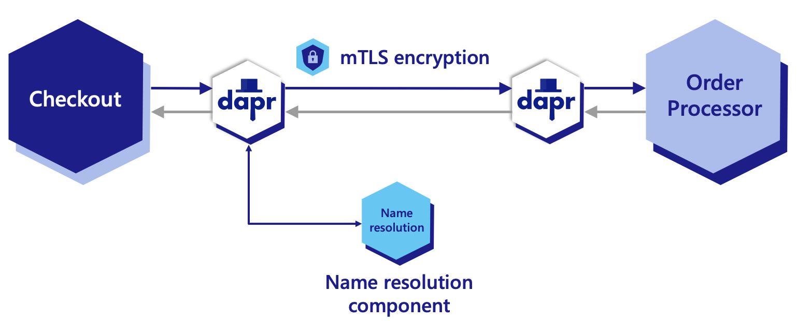
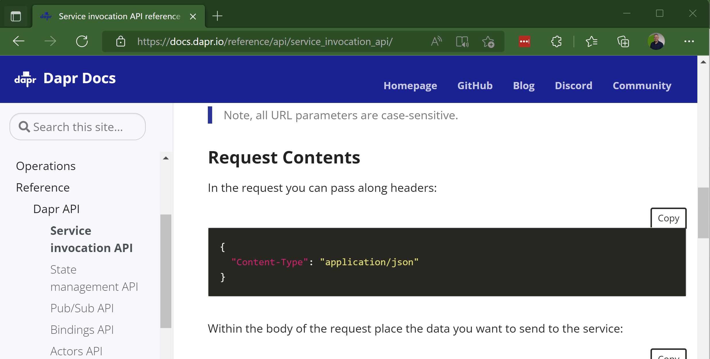
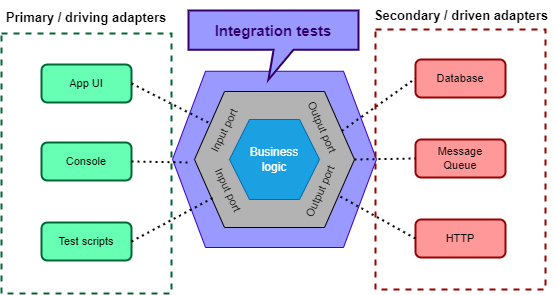
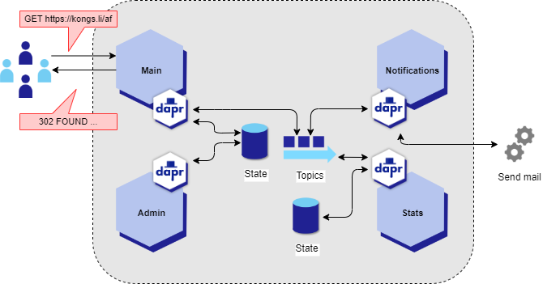
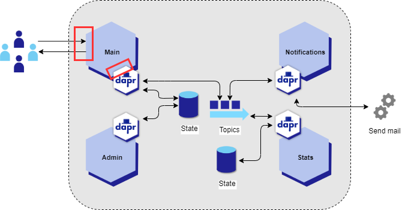
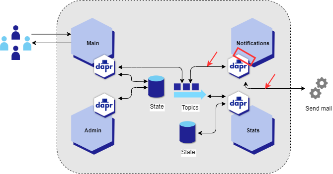

class: center, middle

# Making **test-friendly** microservices with **Dapr**

#### Swetugg Göteborg ✌️ Vidar Kongsli

---

background-image: url(./images/IMG_20210314_124902.jpg)
background-position: center;
color: white;
class: whitefont

# Vidar Kongsli

* 21 years experience in software development
* 16 years experience in .NET
* Lives in Oslo, Norway
* Twitter/GitHub/LinkedIn: `vidarkongsli`
* Works at **Bredvid AS** - `bredvid.no`
   * Oslo-based software development consultancy
   *  🌐`https://www.bredvid.no`  ✉️`jobb@bredvid.no`

---

class: center, middle

# Software testing

???

* We are going to talk about testing
* A topic that is near and dear to my heart, and has been for many years
* I assume that you are have a basic familiarity with automated software testing
* ...that you have written at least one test in code before

---

class: center, middle
# **Dapr**
# *Distributed Application Runtime*

???

* And we are going to talk about Dapr. How many of you know about Dapr?
* Mind you, it is not Dapper - the lightweight object relational mapper, but Dapr
* We will talk more about Dapr later on, but first focus a little on the testing part

---

# The promise of microservices

What are microservices 🤔?

1. Highly maintainable and testable
1. Loosely coupled
1. Independently deployable
1. Organized around business capabilities
1. Owned by a small team

???

* Point one: highly maintainable and testable
* There it is, testable. I would argue that this does not come automatically, you have to work for it. Let's have a look at the challenges and possible solutions
* Some of the other points are also interesting. Loosely coupled. Independenly deployable
* Let's keep these in mind for later

---

# Testing

## ... we really mean automated testing

???

* I am not too fond of many of the distinctions, like unit tests, integration tests, acceptancy tests and all the rest of it
* Quite frankly, I do not care too much of the defintions.
* But before moving on, spend a second on what would be the ideal test to you...

---

class: center, middle
# Testing pyramid

.img-width-all[]

???

* One way of looking at it is the so-called testing pyramid
* It tries to convey the number of tests you should have of the different types of tests
* You should have more unit tests than integration tests, and more integration tests than UI tests.
* The main argument here, is that the unit tests are easier to handle and quicker to execute than integration tests

---

class: center, middle

# Testing pyramid

.img-width-all[]

???

* Of course, this talk is about microservices, so lets call them API tests instead of UI tests

---

class: center, middle

# Testing *diamond*?

.img-width-all[]

???

* I tend to disagree with this view, and I would say that maybe it should look like this.
* Maybe we could call it the testing diamond.
* Again, I am not too preoccupied with definitions of test types here
* But of course it depends on how you define a unit tests, meaning what is your definition of a unit?
* I use the definition that the unit is a type, or in OO often a class

---

class: center, middle

# Upside-down testing pyramid

.img-width-all[]

???

* If we take it a bit further, I could even suggest that we for a microservice would have something like this.
* With API tests, I mean that we test the microservice as a whole.
* Integration tests would be tests for various components within the microservice.

---

# Unit tests

* Do not catch problems "in between"
* Cumbersome to test for the "real" conditions
* Spend much time simulating the environment; mocking and stubbing
* Too brittle in terms of refactoring - spend a lot of time rewriting
* A class of tests could be left to the compiler
  * Static types
  * Null checks
  * Input validation
* Tests do not really have to be super quick

???

* To put some arguments to the upside-down testing pyramid, let's dwell a bit on unit tests

---

class: center, middle

# *Let API or integration tests be the norm, and leave unit tests for the special cases.*

???

* So, the basic idea here can be summarized as follows
* The next question is how we can do this

---

class: center, middle

# *Very well. But how? 🤷‍♂️*

---

# Integration tests in ASP.NET

* In-memory test server
* Craft requests to the application that execute in-process
* Nuget package [Microsoft.AspNetCore.Mvc.Testing](https://www.nuget.org/packages/Microsoft.AspNetCore.Mvc.Testing)
* Article: [Integration tests in ASP.NET Core](https://docs.microsoft.com/en-us/aspnet/core/test/integration-tests?view=aspnetcore-6.0)

---
# Demo

.center[]

???

* 

---

# Integration test with Asp.Net

**EndpointTests.cs:**

```cs
[Theory]
[InlineData("/swagger")]
[InlineData("/health")]
public async Task GetEndpoints(string url)
{
  var client = _factory.CreateClient();
  var response = await client.GetAsync(url);

  response.EnsureSuccessStatusCode();    
}
```

???

* Fires up the entire application in memory for the test
* The factory creates an HTTP client implmentation that acts like a normal HttpClient, but which do not send any requests over the wire
* This tests two endpoints in the application, and indirectly that the application can start up correctly
* But in order to achieve this, we needs some tricks up our sleeves

---

# DI container initialization

**Program.cs:**

```cs
var builder = WebApplication.CreateBuilder(args);
builder.Services.AddControllers();
builder.Services.AddEndpointsApiExplorer();
builder.Services.AddSwaggerGen();
builder.Services.AddTransient<IShortUrlService, EfShortUrlService>();
builder.Services.AddDbContext<ShortUrlDbContext>(options => {
    var folder = Environment.SpecialFolder.LocalApplicationData;
    var path = Environment.GetFolderPath(folder);
    options.UseSqlite($"Data Source={Path.Join(path,
      "shorturls.db")}");
});
builder.Services.AddHealthChecks();
var app = builder.Build();
```

???

* Normal initialization of a dependency injection container might look like this
* Notice the adding of the DbContext: let's say, that in our tests we would like to use an in-memory database instead of Sqlite
* (I am not saying that this is strictly necessary, in fact there are good reasons for keeping sqlite in our test runs.)

---

# Changing DI for testing

**CustomWebApplicationFactory.cs:**

```cs
public class CustomWebApplicationFactory<TProgram>
  : WebApplicationFactory<TProgram> where TProgram : class
{
  protected override void ConfigureWebHost(IWebHostBuilder builder)
  {
    builder.ConfigureServices(services => {
      var descriptor = services.Single(d => d.ServiceType
        == typeof(DbContextOptions<ShortUrlDbContext>));
      services.Remove(descriptor);
      services.AddDbContext<ShortUrlDbContext>(options => 
        options.UseInMemoryDatabase("InMemoryForTesting"));
    });
  }
}
```

???

* 

---

# Using test DI setup

**EndpointTests.cs:**

```cs
public class EndpointTests
  : IClassFixture<CustomWebApplicationFactory<Program>>
{
    private readonly CustomWebApplicationFactory<Program> _factory;

    public EndpointTests(CustomWebApplicationFactory<Program> factory)
        => _factory = factory;

    [Theory]
    [InlineData("/swagger")]
    [InlineData("/health")]
    public async Task GetEndpoints(string url)
    {
        var client = _factory.CreateClient();
        var response = await client.GetAsync(url);

        response.EnsureSuccessStatusCode();    
    }
}
```

---

# Challenge: dependencies

.center[.img-width-all[]]

???

* One challenge to microservices is how to handle its dependencies
* A list of dependencies such as this might be familiar to you
* A list of dependencies such as this also becomes a challenge to testing
* The particurlar challenge for testing in a situation like this, is how to handle the fact that the service reaches out to third party serviecs via libraries
* With this challenge in mind, it is about time to introduce Dapr into the mix!
* Biblioteker
* API-er
* Lære seg API-enes mekanismer
* Holde avhengighetene oppdatert


---

class: center

# Dapr

.left-column[
### APIs for building portable and reliable microservices

]
.right-column[.img-width-half[]]

---

# The sidecar pattern
<figure>
.img-width-all[]
<figcaption align="center">Photo by <a href="https://unsplash.com/@ficklesupreme?utm_source=unsplash&utm_medium=referral&utm_content=creditCopyText">Max Simonov</a> on <a href="https://unsplash.com/s/photos/sidecar?utm_source=unsplash&utm_medium=referral&utm_content=creditCopyText">Unsplash</a></figcaption>
</figure>

???

* One central concept in Dapr is the sidecar pattern
* As you may or may not know, a sidecar is originally an extra passenger seat stitched on to a motorcycle
* Quite rear and quaint these days, but depending on your age, you may or may not have seen one in real life. I am revealing my age here...

---

# Interaction with Dapr

.img-width-all[]

* HTTP or gRPC
* Two-way communication:
   * The application calls the Dapr API (*"pull"*)
   * Dapr calls endpoints exposed by the application (*"push"*)

---

class: center

# Service invocation

.img-width-all[]

---

class: center

# Publish - subscribe

.img-width-all[]

---

class: center

# State management

.img-width-all[]

---

class: center

# Dapr building blocks

### &nbsp;

.img-width-all[]

---

class: center
# What does this mean

## ...for development?

.img-width-all[]

???

* A developer would program against the Dapr APIs
* HttpClient is your friend
* Let's see how this would look like in code

---

# Named HttpClient

Program.cs:

```csharp
var daprHttpPort = Environment
  .GetEnvironmentVariable("DAPR_HTTP_PORT");

builder.Services.AddHttpClient("state", client => {
    client.BaseAddress
      = new Uri($"http://localhost:{daprHttpPort}/v1.0/state/");
});

builder.Services.AddHttpClient("publish", client => {
    client.BaseAddress
      = new Uri($"http://localhost:{daprHttpPort}/v1.0/publish/");
});
```

???

* Familiar with the HttpClientFactory pattern in .NET
* When the application runs in a Dapr-enabled infrastructure, the Dapr sidecar port is set as an environment variable
* The Dapr building block definitions give you the endpoint you need to call in the sidecar
* We use the "named" httpclient factory pattern

---

# Retrieve state

```cs
const STORE_NAME = "shorturls";

public async Task<ShortUrl> Get(string shortPath)
{
  var client = _httpClientFactory.CreateClient("state");
  var result = await client.GetAsync($"{STORE_NAME}/{shortPath}");
  if (result.StatusCode == HttpStatusCode.NoContent)
    return ShortUrl.Empty();
  if (result.IsSuccessStatusCode)
  {
    return await result.Content.ReadFromJsonAsync<ShortUrl>()
      ?? ShortUrl.Empty();
  }
  throw new Exception($"GET {result.RequestMessage?.RequestUri}"
    + $", error was {result.ReasonPhrase}");
}
```

???

* Create an HttpClient instance
* First path component is the store name, and second is the key
* If the key is not found, it returns no content (NOT 'not found', mind you!)
* Deserialize from Json into a typed object

---

# Save state

```cs
public record SaveRequest<T>(string Key, T Value);

const STORE_NAME = "shorturls";

public async Task Save(params ShortUrl[] shortUrls)
{
  var client = _httpClientFactory.CreateClient("state");
  var result = await _client.PostAsJsonAsync(STORE_NAME,
    shortUrls.Select(shortUrl
      => new SaveRequest<ShortUrl>(shortUrl.ShortPath, shortUrl)));
  if (!result.IsSuccessStatusCode)
  {
    throw new Exception($"GET {result.RequestMessage?.RequestUri}"
      + $", error was {result.ReasonPhrase}");
  }
}
```

???

* Saving state is very similar, only use 'POST', and have the key as part of the payload
* Create a SaveRequest record to wrap the payload
* Can even save several objects at a time

---

# Publish to a topic

```cs
const string PUBSUB_NAME = "urlshortener-pub-sub";
const string TOPIC_NAME = "requests";

public record RequestEvent (string Id, string ShortPath, bool IsMatch,
  DateTimeOffset TimeStamp, string? Browser = null,
  string? Region = null, string? Country = null,
  string? IpAddress = null);

var requestEvent = new RequestEvent(Guid.NewGuid().ToString(),
  shortPath, found, DateTimeOffset.UtcNow,
  IpAddress: httpRequest
    .HttpContext.Connection.RemoteIpAddress?.ToString());

var client = _httpClientFactory.CreateClient("publish");
await client.PostAsJsonAsync($"{PUBSUB_NAME}/{TOPIC_NAME}",
  requestEvent);
```

???

* Publishing a message to a topic is similar to saving state
* This time, we use the "publish" http client
* Need the name of the pub sub component and the topic name

---

# Subscribe to a topic

```cs
public record DaprData<T>
  ([property: JsonPropertyName("data")] T Data); 

public class EventNotificationController
{
  private const string PUBSUB_NAME = "urlshortener-pub-sub";
  private const string TOPIC_NAME = "requests";

  [Topic(PUBSUB_NAME, TOPIC_NAME)]
  [HttpPost("request")]
  public async Task<IActionResult> ReceiveRequestEvent(
    [FromBody]DaprData<RequestEvent> message)
  {
    var requestEvent = message.Data;
    var wasProccessedCorrectly = ...;
    return wasProccessedCorrectly
      ? new OkResult()
      : new StatusCodeResult((int)HttpStatusCode.TooManyRequests); 
    }
```

???

* Now it gets more interesing
* Subscribing to a topic is different
* The integration here is a push to the application via a controller

---

# What does this mean
## ...for testing?

???

* We have now gotten a little insight into how the code will look like when interacting with Dapr
* Let's zoom out a little bit and what repercussions this will have for the application architecture

---

# Ports and adapters

### A.k.a. *Hexagonal architecture*

.center[.img-width-all[]]

???

* Let's consider the ports and adapters software architecture pattern
* It was coined some years ago by Alistair Cockburn, one of the authors of the agile manifesto
* An alternative to the earlier, layered archtecture for software
* Depics the business logic of the application to be at the core
* Ports provide a generic way to communicate with the business logic, separated into input and output ports
* Adapters implement specific ways the environment communicates with the application core (via ports)
* Separated into primary/driving adapters, and secondary/driven adapters

https://alistair.cockburn.us/hexagonal-architecture/
https://en.wikipedia.org/wiki/Hexagonal_architecture_(software)
https://medium.com/idealo-tech-blog/hexagonal-ports-adapters-architecture-e3617bcf00a0

---

# Integration tests

### ...with ports and adapters

.center[.img-width-all[]]

???

* One idea here is that we can create our integration tests by interacting with the ports, leaving out the adapters
* Since ports are generic, input ports can be driven by our tests, and the output ports will need test stubs and mocks set up
* Mocks will be used to verify expected side-effects of the test execution, stubs can be used to provide test data to our tests

---

# Adapters with Dapr

### ...are transparent, comprenesive, trivial?

.center[.img-width-all[]]

???

* So, how does our use of Dapr impact our architecture?
* Well, all the adapters essentially become HTTP-based
* The primary adapters are controllers if you use the MVC patterns, or plan Kestrel middleware if not
* The secondary adapters can all be based on HttpClient

---

# API tests with Dapr

.center[.img-width-all[]]

???

* So the idea then, if adapters are transparent and comprehensive, they can be included in our test runs
* We can test the microservice as a whole by poking at its interface with the world.
* The tests would call the microservice in the same manner as other, consuming microservices would do in production
* The microservice will produce calls to consumed microservice as it would do in production


---

# A demo application


.center[.img-width-all[]]

---

# Redirection tests

```cs
[Theory]
[InlineData("/ex", HttpStatusCode.Found)]
[InlineData("", HttpStatusCode.NotFound)]
public async Task ShouldRedirectIfFound(string path,
  HttpStatusCode expectedHttpStatusCode)
{
  InitializeDrivenAdapters();
  var client = _factory.CreateClient();
  var result = await client.GetAsync(path);

  Assert.Equal(expectedHttpStatusCode, result.StatusCode);
  VerifyDrivenAdapterExpectations();
}
```

---
# Redirection tests

.center[.img-width-all[]]

---

# Inject HttpClientFactory

**CustomWebApplicationFactory.cs:**

```cs
public class CustomWebApplicationFactory<TProgram>
  : WebApplicationFactory<TProgram> where TProgram : class
{
  public MockHttpClientFactory HttpClientFactory { get; }
    = new MockHttpClientFactory();

  public CustomWebApplicationFactory()
    => ClientOptions.AllowAutoRedirect = false;   

  protected override void ConfigureWebHost(IWebHostBuilder builder)
  {
    builder.ConfigureServices(services => 
    {
      services.AddSingleton<IHttpClientFactory>(HttpClientFactory);
    });
  }
}
```

---

# Intercept HTTP calls

**MockHttpClientFactory.cs:**

```cs
public class MockHttpClientFactory : IHttpClientFactory
{
  private readonly Dictionary<string, MockHttpMessageHandler>
    _handlers = new();

  public HttpClient CreateClient(string name)
  {
    var mockMessageHandler = _handlers.ContainsKey(name)
      ? _handlers[name] : new MockHttpMessageHandler();
    var httpClient = mockMessageHandler.ToHttpClient();
    httpClient.BaseAddress = new Uri($"http://localhost/");
    return httpClient;
  }

  public MockHttpMessageHandler CreateHttpResponsesFor(string name)
  {
    if (!_handlers.ContainsKey(name))
      _handlers.Add(name, new MockHttpMessageHandler());
    return _handlers[name];
  }
}
```

***** Nuget package [RichardSzalay.MockHttp](https://github.com/richardszalay/mockhttp).

---

# Stubbing

```cs
private void InitializeDrivenAdapters()
{
  var stateHttpClient = _factory.HttpClientFactory
    .CreateHttpResponsesFor("state");
  
  stateHttpClient.Clear();
  
  stateHttpClient.When(HttpMethod.Get,
    "http://localhost/shorturls/ex")
    .Respond("application/json",
      EmbeddedResource.ReadTestData<RedirectionTests>("State",
        "GetShortUrlsExpressenResponse.json"));
  
  stateHttpClient.Fallback.Respond(request => throw new Exception(
    "HttpClient stub 'state' did not have knowledge of "
      + $"{request.Method} {request.RequestUri}"));
}
```

---

# Mocking

```cs
private void InitializeDrivenAdapters()
{
  var publishHttpClient = _factory.HttpClientFactory
    .CreateHttpResponsesFor("publish");
  publishHttpClient.Clear();
  publishHttpClient
   .Expect(HttpMethod.Post, "http://localhost/"
     + RequestEventPublisher.PUBSUB_NAME + "/"
     + RequestEventPublisher.TOPIC_NAME;
   .Respond(HttpStatusCode.NoContent);
}

private void VerifyDrivenAdapterExpectations()
{
  _factory.HttpClientFactory
    .CreateHttpResponsesFor("publish")
    .VerifyNoOutstandingExpectation();
}
```

---

# Notification tests


.center[.img-width-all[]]

---

# Mocking email binding

```cs
[Fact]
public async Task ShouldSendNotificationIfNoMatchEventReceived()
{
  var bindingsHttpClient = _factory
    .HttpClientFactory.CreateHttpResponsesFor("bindings");

  bindingsHttpClient.Clear();

  bindingsHttpClient.Expect(HttpMethod.Post,
    "http://localhost/email")
    .WithPartialContent("Short url /ex did not match")
    .Respond(HttpStatusCode.OK);

  bindingsHttpClient.Fallback.Respond(request
    => throw new Exception(
      "HttpClient stub 'bindings' did not have knowledge of "
      + "${request.Method} {request.RequestUri}"));
  ...
```

---

# Testing notifications

```cs
[Fact]
public async Task ShouldSendNotificationIfNoMatchEventReceived()
{
  var client = _factory.CreateClient();

  var requestEvent = new RequestEvent(Guid.NewGuid().ToString(),
    "/ex", false, DateTimeOffset.UtcNow,
    IpAddress: "127.0.0.1");
        
  var requestEventMessage = new DaprData<RequestEvent>(requestEvent);

  var result
    = await client.PostAsJsonAsync("/request", requestEventMessage);

  result.EnsureSuccessStatusCode();

  bindingsHttpClient.VerifyNoOutstandingExpectation();
}
```
---
# Tips and tricks

1. Build a catalog of request/response data
   * Embedded resources in your test projects
   * Use in stubs and mocks
1. Inspect Dapr API
   * Documentation at [dapr.io](https://dapr.io).
   * Use **REST Client** VS Code extension to poke at your sidecar

---

# What we have achieved


---

# What we have achieved

1. Less dependencies

---

# Dependencies lost 🎉

```xml
<Project Sdk="Microsoft.NET.Sdk.Web">

  <PropertyGroup>
    <TargetFramework>net6.0</TargetFramework>
    <Nullable>enable</Nullable>
    <ImplicitUsings>enable</ImplicitUsings>
  </PropertyGroup>

  <ItemGroup>
    <PackageReference Include="Swashbuckle.AspNetCore"
      Version="6.2.3" />
  </ItemGroup>

</Project>
```

---

# What we have achieved

1. Less dependencies

---

# What we have achieved

1. Less dependencies
1. Transparent and coherent communication with the world

---

# What we have achieved

1. Less dependencies
1. Transparent and coherent communication with the world
1. Lowered the bar for focusing on API tests rather than unit tests

---
# What we have achieved

1. Less dependencies
1. Transparent and coherent communication with the world
1. Lowered the bar for focusing on API tests rather than unit tests
1. Tests that are oblibious to the application's inner structure
   * Refactoring does not break tests

---

# Dapr building blocks

Same stubbing/mocking pattern available for
* Application configuration
* Application secrets

### &nbsp;

.img-width-all[]

---

background-image: url(./images/IMG_20210314_124902.jpg)
background-position: center;
color: white;
class: whitefont

# Questions?

Contact me:

* ✉️ `vidar.kongsli@bredvid.no`
* Twitter/GitHub/LinkedIn: `vidarkongsli`
